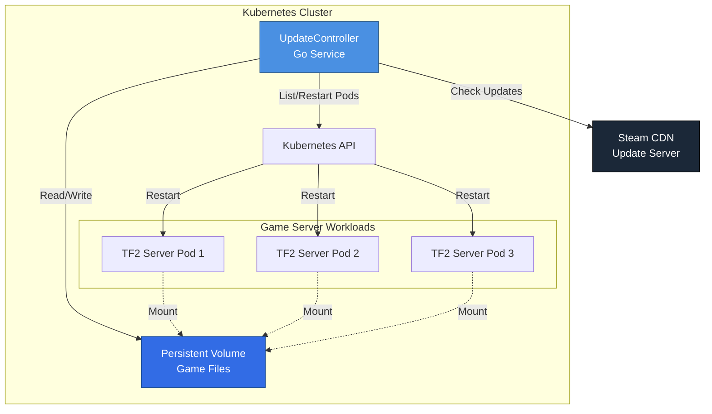
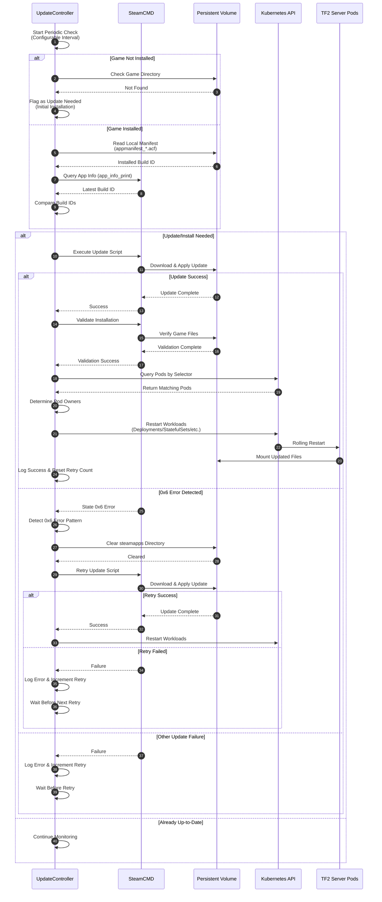
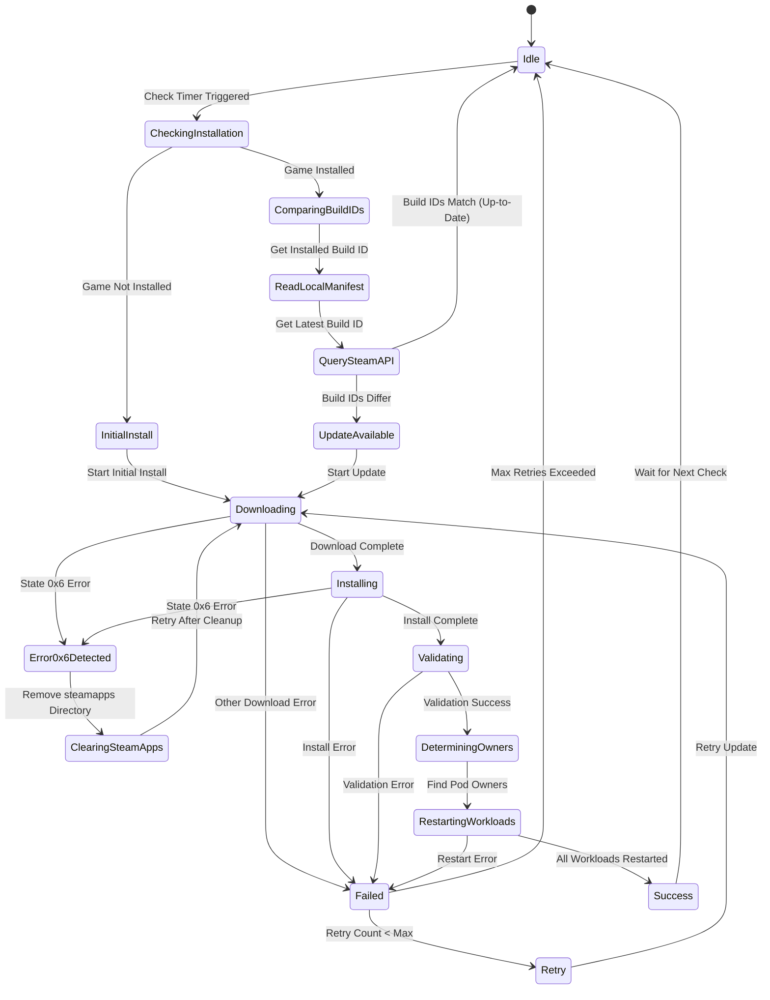

# UpdateController

A Kubernetes controller written in Go that automatically manages updates for Team Fortress 2 (TF2) game servers running in a cluster. The controller monitors for game updates using SteamCMD, applies updates when available, and orchestrates pod restarts to ensure servers run the latest version.

[](https://golang.org/)
[](LICENSE)

## Overview

The UpdateController is a Kubernetes-native controller that solves the challenge of keeping game servers up-to-date in a containerized environment. It leverages the [ghcr.io/udl-tf/tf2-image](https://github.com/UDL-TF/TF2Image) container which includes SteamCMD for update management.

### Key Responsibilities

- **Monitor**: Periodically check for TF2 server updates using SteamCMD
- **Update**: Download and apply updates to mounted game directories
- **Restart**: Intelligently restart affected Kubernetes workloads (Deployments, StatefulSets, etc.)
- **Handle Errors**: Gracefully manage update failures with retry logic

## Architecture



## How It Works

### Update Check Flow



### Controller State Machine



## Features

- **Automatic Update Detection**: Leverages SteamCMD to detect when TF2 updates are available using build ID comparison (no unnecessary downloads)
- **Initial Installation Support**: Automatically detects and performs initial game installation if not present
- **Build ID Tracking**: Compares local manifest build IDs with Steam's latest build IDs for efficient update detection
- **0x6 Error Recovery**: Automatic detection and recovery from Steam's 0x6 state errors by clearing and retrying
- **Smart Pod Selection**: Restart pods based on:
  - Label selectors (e.g., `app=tf2-server`)
  - Workload ownership detection
- **Multiple Workload Support**: Handles Deployments, StatefulSets, DaemonSets, and ReplicaSets
- **Error Handling**: Configurable retry logic with exponential backoff
- **Update Validation**: Verifies update success before restarting pods
- **Zero-Downtime Updates**: Utilizes Kubernetes rolling restart mechanisms
- **Observability**: Structured logging with klog for detailed operation tracking

## Prerequisites

- Kubernetes cluster (v1.25+)
- Go 1.25+ (for development)
- Access to [ghcr.io/udl-tf/tf2-image](https://github.com/UDL-TF/TF2Image)
- Persistent Volume for game files
- RBAC permissions for pod/deployment management

## Installation

### Using Helm (Recommended)

```bash
# Install the UpdateController from OCI registry
helm install update-controller oci://ghcr.io/udl-tf/helm/update-controller \
  --namespace game-servers \
  --create-namespace \
  --set image.tag=latest \
  --set config.checkInterval=30m

# Or specify a version
helm install update-controller oci://ghcr.io/udl-tf/helm/update-controller \
  --version 0.1.0 \
  --namespace game-servers \
  --create-namespace
```

### Using kubectl

```bash
# Apply the controller manifest
kubectl apply -f https://raw.githubusercontent.com/UDL-TF/UpdateController/main/deploy/controller.yaml
```

### From Source

```bash
# Clone the repository
git clone https://github.com/UDL-TF/UpdateController.git
cd UpdateController

# Build the controller
go build -o update-controller ./cmd/controller

# Run locally (for development)
./update-controller --kubeconfig=$HOME/.kube/config
```

## Configuration

### Environment Variables

| Variable          | Description                       | Default                | Required |
| ----------------- | --------------------------------- | ---------------------- | -------- |
| `CHECK_INTERVAL`  | Interval between update checks    | `30m`                  | No       |
| `STEAMCMD_PATH`   | Path to SteamCMD executable       | `/home/steam/steamcmd` | No       |
| `STEAMAPP`        | Steam app name (TF2)              | `tf`                   | No       |
| `STEAMAPPID`      | Steam app ID                      | `232250`               | No       |
| `GAME_MOUNT_PATH` | Path where game files are mounted | `/tf`                  | No       |
| `UPDATE_SCRIPT`   | Name of the update script         | `tf_update.txt`        | No       |
| `POD_SELECTOR`    | Label selector for TF2 pods       | `app=tf2-server`       | Yes      |
| `MAX_RETRIES`     | Maximum update retry attempts     | `3`                    | No       |
| `RETRY_DELAY`     | Delay between retries             | `5m`                   | No       |
| `NAMESPACE`       | Kubernetes namespace to watch     | `default`              | No       |

### RBAC Configuration

The controller requires the following permissions:

```yaml
apiVersion: rbac.authorization.k8s.io/v1
kind: ClusterRole
metadata:
  name: update-controller
rules:
  - apiGroups: ['']
    resources: ['pods']
    verbs: ['get', 'list', 'watch']
  - apiGroups: ['apps']
    resources: ['deployments', 'statefulsets', 'daemonsets', 'replicasets']
    verbs: ['get', 'list', 'patch']
  - apiGroups: ['']
    resources: ['persistentvolumeclaims']
    verbs: ['get', 'list']
```

## Development

### Project Structure

```
UpdateController/
├── cmd/
│   └── controller/          # Main controller application
│       └── main.go
├── internal/
│   ├── controller/          # Controller logic
│   │   ├── update.go       # Update check & apply
│   │   ├── restart.go      # Pod restart logic
│   │   └── config.go       # Configuration
│   ├── steamcmd/           # SteamCMD integration
│   │   └── client.go
│   └── k8s/                # Kubernetes client wrappers
│       └── client.go
├── deploy/                  # Kubernetes manifests
│   ├── controller.yaml
│   └── rbac.yaml
├── Dockerfile
├── go.mod
├── go.sum
└── README.md
```

### Building

```bash
# Build for your platform
go build -o update-controller ./cmd/controller

# Build Docker image
docker build -t ghcr.io/udl-tf/update-controller:latest .

# Run tests
go test ./...

# Run with race detection
go test -race ./...
```

### Local Development

```bash
# Install dependencies
go mod download

# Run controller locally
go run ./cmd/controller --kubeconfig=$HOME/.kube/config

# Enable debug logging
export LOG_LEVEL=debug
go run ./cmd/controller
```

## License

See [LICENSE](LICENSE) file for details.

## Dependencies

- [TF2Image](https://github.com/UDL-TF/TF2Image) - The base TF2 server image
- [Kubernetes client-go](https://github.com/kubernetes/client-go) - Kubernetes Go client library
